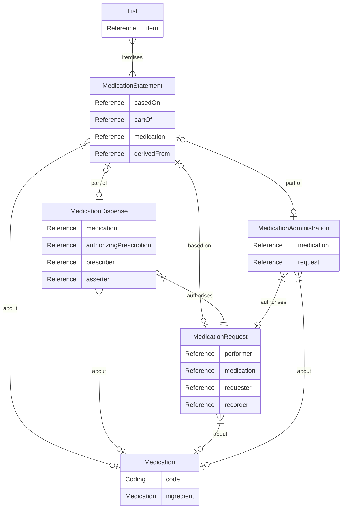

## Medicines Implementation Guide

## Medicines Data Model

A Shared Medicines API Medicines record is made up of a List and MedicationStatement resource and any other 'detail' resources that are provided as part of the Medicines record in the specific domain.

This is a greatly simplified view of the relationships between the main elements of the record.

### MedicationStatement 

The medicines record is made up of MedicationStatement resources which are supported by Patient, Practitoner, RelatedPerson Provenance and Encounter resources.

The patient and one or more practitioners take part in an encounter.  

The encounter represents a meeting of persons, involved for a specific reason, and this can be face to face, virtual and with or without the patient present. 

There may be situations where there is no encounter, especially if the patient or related person is making the record.

A Practitioner represents a health care worker. The health care worker may be assigned a specific role, for example general practitoner, specialist nurse, or consultant.

The practitioner will record the medicine statement.

#### Use cases

The following use cases are available. See [use cases](usecase/index.md) for an overview or the following links for details and examples.

* [View medicines history record for a patient](usecase/view-medicines-history/index.md)

* Update medicines history record for a patient

