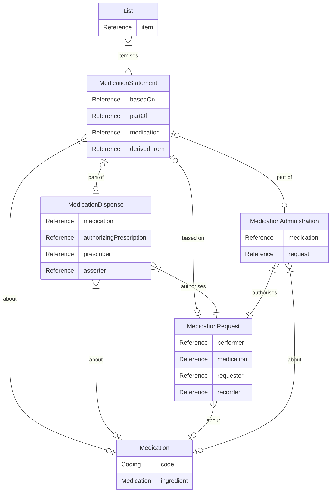

## Medicines Implementation Guide

## Medicines Data Model

A Shared Medicines API Medicines record is made up of a List and MedicationStatement resource and any other 'detail' resources that are provided as part of the Medicines record in the specific domain.

This is a greatly simplified view of the relationships between the main elements of the record.

### Medication resources 

The medicines record is made up of many medication resources. These are supported by List, Patient, Practitoner, RelatedPerson, Provenance and Encounter resources.

The List is a view of medicines at a point in time or from a specific source. This could be the GP record or perhaps a discharge from secondary care. 

The MedicationStatements are just that - statements about an interaction between a medicine and a patient. They do not constitute a prescription, dispensation or consumption of a medication. These are high-level perspectives of a patient's medicines where a dose, product and status can be presented in a conformal and consumable way. The statements may link to, or reference, other resources that describe the relationship with the patient in more detail. 

The patient and one or more practitioners take part in an encounter.  

The encounter represents a meeting of persons, involved for a specific reason, and this can be face to face, virtual and with or without the patient present. 

There may be situations where there is no encounter, especially if the patient or a related person is making the record.

A Practitioner represents a health care worker. The health care worker may be assigned a specific role, for example general practitoner, specialist nurse, or consultant. They may be a licenced prescriber and dispenser of medicines.

A practitioner will make a record about the patients interaction with a medicine. They may need to prescribe. Following on from here, a dispensation of medicines occurs. The healthcare worker or patient may need to record when they take the medicine or if they dont take it at all. 

This process may produce one or more medicationStatements, medicationRequests,  medicationDispenses and medicationAdministrations. Each of these will refer to the medication formulation, and also one another, through this chain of actions.

The practitioner may need to let others know about this activity, epecially if changes have occured. They may wish to capture a list of what they consider relevant at that point in time. A software system may also do this for them, but in either case a List may carry an overview of this information forward and allow the next user to rech into more connected details as they need to.

In this way, the record can be read at various points and specific resource types can be surfaced where most relevant for a given use case.

#### Use cases

The following use cases are available. See [use cases](usecase/index.md) for an overview or the following links for details and examples.

* [View medicines history record for a patient](usecase/view-medicines-history/index.md)

* Update medicines history record for a patient

