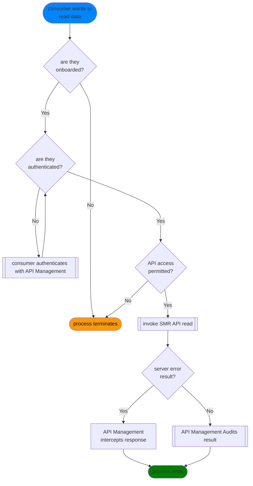

## read data from SMR API

> see also:  [security](security.md) | [audit](audit.md) | [Invoke SMR API (read)](invocation.md)

As an overview, the pattern for calling the API involves speaking to an API gateway/management system. For our purposes, the gateway handles authentication and audit.

