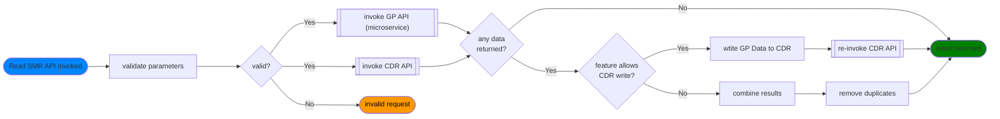
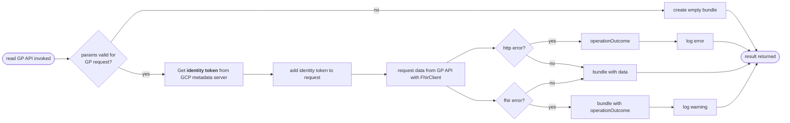
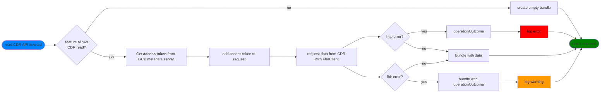

## Invoke SMR API (read) 

This is where the API itself takes over. It combines responses from two sources (when safe and configured to do so) and gives a single result to the consumer. 

### sub-process: Invoke GP API

>  See also: [read data from SMR GP API](read-gp-data/index.md)

The GP API invocation needs an *identity token* to call a cloud run instance from the service account making the call. The token is generated from the internal metadata server in GCP. Note that code execution outside of GCP wont have access to the metadata server so developers and pipelines will use other means.

### sub-process: Invoke CDR API

The CDR invocation needs an *access token* to call the FHIR store from the service account making the call. The token is generated from the internal metadata server in GCP. Note that code execution outside of GCP wont have access to the metadata server so developers and pipelines will use other means.

