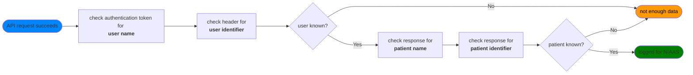

## sub-process: find GP supplier

When the GP prctice code is known we can locate the suppliers  API endpoint

```mermaid
     flowchart LR
 

    TRIGGER(["API request succeeds"]) 
    S1["check authentication token for <br><b>user name</b>"]
    S2["check header for <br><b>user identifier</b>"]
    S3{"user known?"}
    S4["check response for <br><b>patient name</b>"]
    S5["check response for <br><b>patient identifier</b>"]
    S6{"patient known?"}

    ABORT(["not enough data"])
    SUCCESS(["logged for NIAAS"])
   
TRIGGER --> S1
S1 ---> S2
S2 ---> S3
S3 -- No ---> ABORT
S3 -- Yes ---> S4
S4 --> S5
S5 --> S6
S6 -- No ---> ABORT
S6 -- Yes ---> SUCCESS
       

style TRIGGER fill:#0085FC
style ABORT fill:#ff9900, color:#000
style SUCCESS fill: green
```
