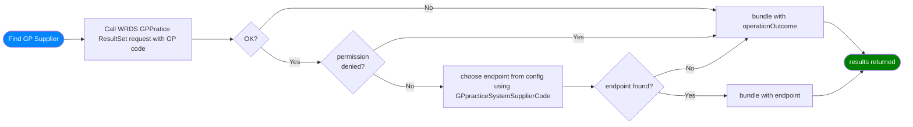

## sub-process: find GP supplier

When the GP practice code is known we can locate the suppliers  API endpoint

> see also: [FHIR mapping](map-to-fhir/index.md)

```mermaid
     flowchart LR
 

    TRIGGER(["Find GP Supplier"]) 
    S1["Call WRDS GPPratice ResultSet request with GP code"]
    S2{"OK?"}
    S3{"permission <br>denied?"}
    S4["choose endpoint from config using GPpracticeSystemSupplierCode"]
    S4A{"endpoint found?"}
    S5["bundle with operationOutcome"]
    S6["bundle with endpoint"]

    SUCCESS(["results returned"])
   
TRIGGER --> S1
S1 ---> S2
S2 -- No ---> S5
S2 -- Yes ---> S3
S3 -- No ---> S4
S3 -- Yes ---> S5
S4 --> S4A
S4A -- No ---> S5
S4A -- Yes ---> S6
S5 --> SUCCESS
S6 --> SUCCESS

       

style TRIGGER fill:#0085FC, color:#fff

style SUCCESS fill: green, color:#fff
```
