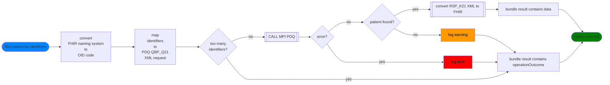

## sub-process: find patient by identifiers

The patient's NHS number and GP Practice code are needed to invoke the GP supplier's API. 

```mermaid
flowchart LR
 

    TRIGGER(["find patient by identifiers"]) 
    S1["convert <br>FHIR naming system<br> to <br>OID code"]
   	S2["map <br>identifiers <br>to <br>PDQ QBP_Q21 <br>XML request"]
    S2A{"too many <br> identifiers?"}
    S3[["CALL MPI PDQ"]]
    S3A{"error?"}
    S3B{"patient found?"}
    S4[["convert RSP_K21 XML to FHIR"]]

    E4A[bundle result contains data]
    E4B[bundle result contains operationOutcome]


    SUCCESS(["result returned"])
    LOGERROR["log error"]
    LOGWARNING["log warning"]


TRIGGER --> S1
S1 ---> S2
S2 ---> S2A
S2A -- no ---> S3
S2A -- yes ---> E4B
S3 --> S3A
S3A -- no ---> S3B
S3A -- yes ---> LOGERROR


S3B -- yes ---> S4
S3B -- no ---> LOGWARNING

S4 --> E4A


%%E4C --> LOGERROR

LOGERROR --> E4B
LOGWARNING --> E4B
E4A --> SUCCESS
E4B --> SUCCESS


style TRIGGER fill:#0085FC
style LOGERROR fill:red, color:#000
style LOGWARNING fill:#ff9900, color:#000
style SUCCESS fill: green

```
