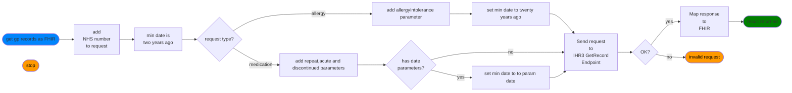

## sub-process: get gp records as FHIR

> see also: [FHIR mapping](map-to-fhir/index.md)

The GP supplier endpoint is invoke with the NHS number and the results are convered to FHIR resources. Note that the *20 years* noted allows for the approximate period that the supplier software was brought into service.

