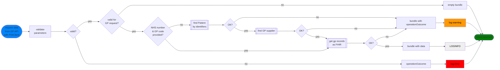

## Invoke SMR GP API (read) 

> See also: [find patient by identifiers]() | [find gp supplier]() | [get GP records as FHIR]()

This process is invoked from the main SMR API entry point and is not directly exposed to api consumers. The consumer parameters are inspected and further actions follow to get the GP data in FHIR format.

