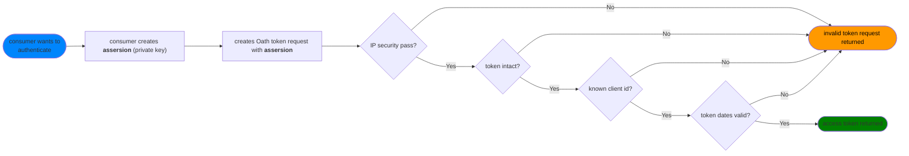

## authentication

The gateway authentication process uses an Oauth flow with private keys. The route contains several checks (simplified) before an access token is made available.

```mermaid
flowchart LR
 

    TRIGGER(["consumer wants to <br>authenticate"]) 
    S1["consumer creates <b>assersion</b> (private key)"]
    S2[creates Oath token request with <b>assersion</b>]
    S3{"IP security pass?"}
    S4{"token intact?"}
    S5{"known client id?"}
    S6{"token dates valid?"}
    ABORT(["invalid token request returned"])
    SUCCESS(["access token returned"])
   
TRIGGER --> S1
S1 ---> S2
S2 ---> S3
S3 -- No ---> ABORT
S3 -- Yes ---> S4
S4 -- No ---> ABORT
S4 -- Yes ---> S5
S5 -- No ---> ABORT
S5 -- Yes ---> S6
S6 -- No ---> ABORT
S6 -- Yes ---> SUCCESS


style TRIGGER fill:#0085FC
style ABORT fill:#ff9900, color:#000
style SUCCESS fill: green
```

