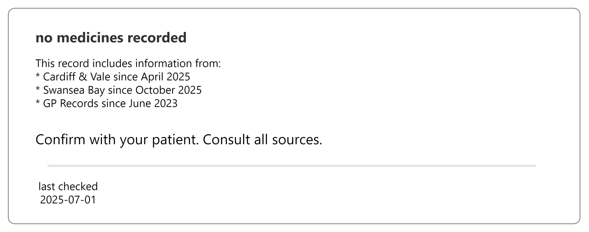

# View medicines history record for a patient

## Wireframes

Wireframes are not prescriptive. See notes on [how to use wireframes](https://github.com/acommonjones/allergy-guide/blob/main/usecase/index.md#understanding-wireframes)

**Walk-through samples**

- [No entries in the record](#list-view-no-entries)

- [Multiple entries in the record](#list-view-record-with-entries)

- [Excessive entries in the record](#list-view-record-with-excessive-entries)

- Incomplete detail in the record

- [Activities highlight in the record](#list-view-record-with-activity-highlights)

  

### User goals

- see up to two years of patient medicines history
- see when elements need attention
- search / filter to find specific things

### Interface goals

- minimise cogntive load

- minimise screen time

- minimise need for a keyboard and mouse

- use data intelligently

### List view: no entries

#### The user can:

1. clearly see there is no record of medicines
2. understand what sources are included in the record
3. see when it was last checked

### List view: record with entries

#### The user can:

1. see one or more entries
2. understand what sources are included in the record
3. see entries are ordered latest first by list date
4. see that each entry contains one or items
5. for an item in an entry they can see the [item summary view](#item-summary-view)
6. see when the record was last checked

### List view: record with excessive entries

#### The user can:

1. see [record with entries](#list-view-record-with-entries) **PLUS**
2. see that there are more entries not shown
  1. see the amount and time frame of entries not shown

   

### List view: record with activity highlights

#### The user can:

  1. see [record with entries](#list-view-record-with-entries) **PLUS**
  2. see an activity summary
     1. see if an activity added a medicine
     2. see if an activity changed a medicine

### item summary view

#### The user can:

   1. see a medicine name
   2. see a status
   3. see a dose instruction
   4. see when it was last issued (if issued)
      1. how many times its been issued compared to the total allowed (if a repeat medication)
   5. see there may be problems with the medicine

### item detail view

#### The user can:

   1. see [item summary view](#item-summary-view) **PLUS**
   2. see the prescriber
   3. see the recorded date
   4. effective date (either from, to or both)
   5. see the reason for the medication (indication)
   6. see the reason for a change
   7. see notes
   8. see any data is missing or unknown
   9. see why there are problems with the medicine

## Diagrams

### Process: View medicines history

